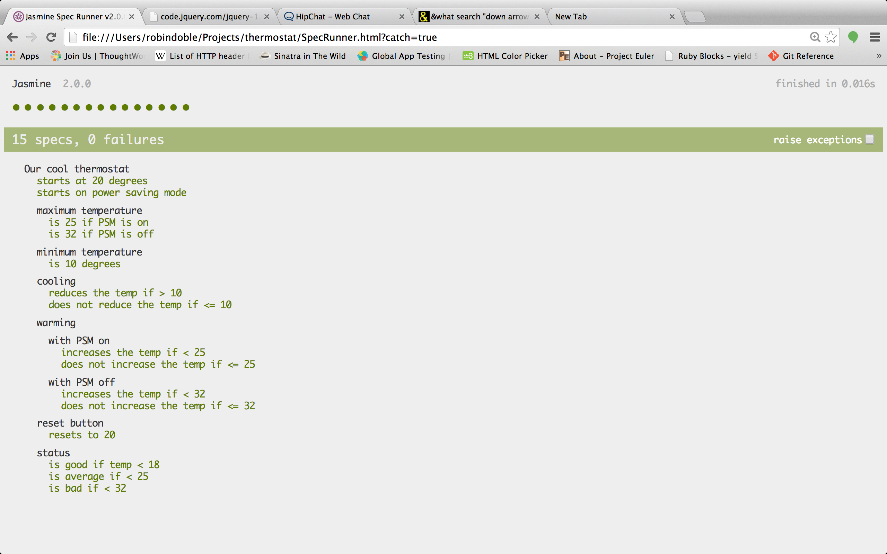

Thermostat
==========

Continuing to develop our knowledge of JS and Jasmine, we created the logic for a working thermostat. There is a small interactive html page that demonstrates the key features including: a power saving mode, max/min temperatures, color variance with temperature. 

Technologies & Learning outcomes
----
- Intro to Javascript
- Intro to the JQuery library
- TDD/Jasmine
- Chrome console

How to demo
----
git clone git@github.com:robindoble/rockpaperscissors.git
run server.rb (sinatra app)

